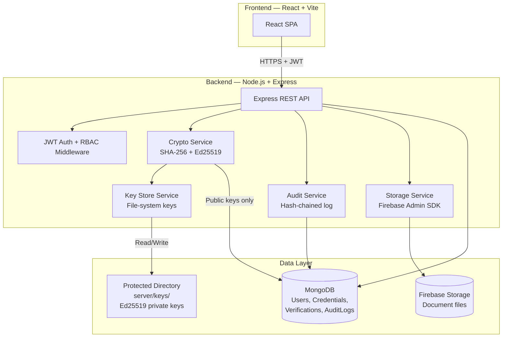
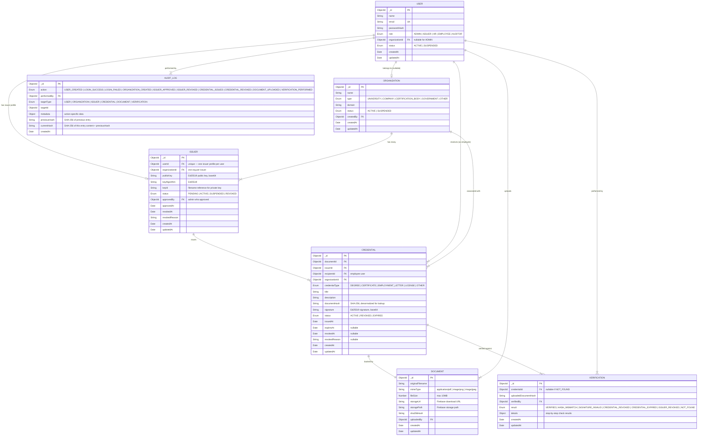

# SecureWork Verify — Finalized Implementation Plan (v1)

> **Status:** ✅ Approved. Milestone 1 in progress.
> **Last updated:** 2026-08-30
>
> **Post-approval corrections:**
> - Directory names: `frontend/`, `backend/`, `docs/` (not `client/`, `server/`)
> - On issuer revocation: **disable/invalidate** access to the private key — do NOT delete historical cryptographic material. Public keys remain available for verifying previously issued credentials.

---

## 1. Resolved Design Decisions

All five open questions have been resolved. The decisions below are **frozen for v1**.

| # | Decision | Resolution |
|---|---|---|
| 1 | Private key storage | **File-system, NOT MongoDB.** Server-side protected directory, excluded from Git, configured via env var. Production note: use KMS/HSM. |
| 2 | Issuer approval | **Admin approval required.** Lifecycle: PENDING → ACTIVE → SUSPENDED / REVOKED. Only ACTIVE issuers can sign. |
| 3 | Multi-org issuers | **No.** One issuer → one organization. One organization → many issuers. One issuer → one Ed25519 keypair. |
| 4 | Employee self-verification | **Yes.** Both EMPLOYEE and HR roles can verify. Auth + RBAC enforced on all verification endpoints. |
| 5 | File types | **Restricted.** PDF, PNG, JPG/JPEG only. Max file size enforced (recommended: 10 MB). |

### Explicitly excluded from v1

| Technology | Reason |
|---|---|
| Blockchain | Architecture decision — not used |
| AI / ML | Not required for core workflow |
| OCR | Not required for hash-based verification |
| Aadhaar / government APIs | Out of scope |
| Microservices | Monolithic backend is sufficient |
| Multiple databases | Single MongoDB instance |
| Zero-knowledge proofs | Over-engineering for v1 |

---

## 2. Finalized Architecture

### 2.1 System overview



### 2.2 Tech stack

| Layer | Technology | Version guidance |
|---|---|---|
| Frontend | React 18+ (JavaScript) via Vite | Latest stable |
| Backend | Node.js 18+ / Express 4.x | LTS |
| Database | MongoDB 7.x via Mongoose 8.x | Latest stable |
| Cloud storage | Firebase Storage via `firebase-admin` | Latest stable |
| Auth | JWT (`jsonwebtoken`) + `bcryptjs` | — |
| Crypto | Node.js built-in `crypto` (SHA-256) + `tweetnacl` (Ed25519) | — |
| Audit | SHA-256 hash-chained append-only log in MongoDB | — |

### 2.3 Key storage architecture

```
server/
├── keys/                        ← PROTECTED DIRECTORY
│   ├── issuer_<issuerId>.key    ← Ed25519 private key (one file per issuer)
│   └── .gitkeep
├── src/
│   └── services/
│       └── keystore.service.js  ← Read/write/delete key files
├── .env                         ← KEY_STORAGE_PATH=./keys
└── .gitignore                   ← Must include /keys/*.key
```

**Rules:**
- Private keys are stored as files in `KEY_STORAGE_PATH` (configured via `.env`)
- File names follow pattern `issuer_<mongoObjectId>.key`
- The `keys/` directory is added to `.gitignore` — never committed
- The API **never** returns private key material in any response
- The `keystore.service.js` service is the only code that reads/writes key files
- MongoDB `Issuer` model stores: `publicKey`, `keyAlgorithm` ("Ed25519"), `keyId` (filename reference) — no private key data

> [!IMPORTANT]
> **Production note:** Replace file-system key storage with a dedicated secrets manager (AWS Secrets Manager, GCP Secret Manager, HashiCorp Vault) or HSM. The `keystore.service.js` abstraction makes this swap straightforward.

---

## 3. Finalized Entity-Relationship Diagram



### 3.1 Key relationship constraints

| Relationship | Cardinality | Constraint |
|---|---|---|
| User → Issuer | 1 : 0..1 | A user has at most one issuer profile (`userId` is unique on Issuer) |
| Issuer → Organization | many : 1 | One issuer belongs to exactly one org; one org has many issuers |
| Credential → Document | 1 : 1 | Each credential is backed by exactly one document |
| Credential → Issuer | many : 1 | An issuer can issue many credentials |
| Credential → User (recipient) | many : 1 | An employee can receive many credentials |
| Verification → Credential | many : 0..1 | A verification may or may not match a credential |
| AuditLog → User | many : 1 | Every audit entry has a performer |

---

## 4. Finalized Security Model

### 4.1 Authentication

```
Client                          Server
  │                               │
  ├── POST /api/auth/login ──────►│
  │   { email, password }         │
  │                               ├── bcrypt.compare(password, user.passwordHash)
  │                               ├── Generate JWT { userId, role, exp }
  │◄── { token, user } ──────────┤
  │                               │
  ├── GET /api/credentials ──────►│
  │   Authorization: Bearer <JWT> │
  │                               ├── auth.middleware: verify JWT, attach req.user
  │                               ├── rbac.middleware: check req.user.role
  │◄── { credentials } ──────────┤
```

- **JWT payload:** `{ userId, role, iat, exp }`
- **Token expiry:** 24 hours (configurable via `JWT_EXPIRES_IN` env var)
- **Password hashing:** bcrypt with salt rounds = 12
- **Token storage (frontend):** `localStorage` (acceptable for v1; production should use httpOnly cookies)

### 4.2 Role-Based Access Control (RBAC)

| Endpoint | ADMIN | ISSUER | HR | EMPLOYEE | AUDITOR |
|---|:---:|:---:|:---:|:---:|:---:|
| `POST /api/auth/register` | ✅ | ✅ | ✅ | ✅ | ✅ |
| `POST /api/auth/login` | ✅ | ✅ | ✅ | ✅ | ✅ |
| `POST /api/organizations` | ✅ | — | — | — | — |
| `GET /api/organizations` | ✅ | ✅ | ✅ | ✅ | ✅ |
| `POST /api/issuers/register` | — | ✅ | — | — | — |
| `PATCH /api/issuers/:id/approve` | ✅ | — | — | — | — |
| `PATCH /api/issuers/:id/revoke` | ✅ | — | — | — | — |
| `GET /api/issuers` | ✅ | ✅ | — | — | — |
| `POST /api/credentials/issue` | — | ✅ | — | — | — |
| `GET /api/credentials` | ✅ | ✅ | ✅ | ✅ | — |
| `PATCH /api/credentials/:id/revoke` | — | ✅ | — | — | — |
| `POST /api/verifications/verify` | — | — | ✅ | ✅ | — |
| `GET /api/verifications` | ✅ | — | ✅ | ✅ | ✅ |
| `GET /api/audit-logs` | ✅ | — | — | — | ✅ |
| `GET /api/audit-logs/validate` | ✅ | — | — | — | ✅ |

> [!NOTE]
> Employees see only their **own** credentials and verifications. HR sees verifications they performed. Issuers see only credentials they issued. ADMIN and AUDITOR have broader read access for oversight.

### 4.3 Cryptographic operations

| Operation | Algorithm | Where | When |
|---|---|---|---|
| Password hashing | bcrypt (12 rounds) | Server | Registration, login |
| Document hashing | SHA-256 | Server (+ optional client preview) | Issuance, verification |
| Document signing | Ed25519 | Server (reads private key from file system) | Issuance |
| Signature verification | Ed25519 | Server (reads public key from MongoDB) | Verification |
| Audit hash chain | SHA-256 | Server | Every audited event |

### 4.4 Document signing flow (detailed)

```
ISSUING:
1. Issuer uploads file via multer
2. Server validates: file type ∈ {PDF, PNG, JPG/JPEG}, size ≤ 10 MB
3. Server computes: documentHash = SHA-256(fileBuffer)
4. Server reads issuer's private key from: KEY_STORAGE_PATH/issuer_<id>.key
5. Server computes: signature = Ed25519.sign(documentHash, privateKey)
6. Server uploads file to Firebase Storage
7. Server creates Document record (hash, storage URL, metadata)
8. Server creates Credential record (hash, signature, issuer, recipient)
9. Server creates AuditLog entry (CREDENTIAL_ISSUED)
10. Private key is never held in memory longer than the signing operation
```

### 4.5 Document verification flow (detailed)

```
VERIFYING:
1. HR/Employee uploads file via multer
2. Server validates: file type ∈ {PDF, PNG, JPG/JPEG}, size ≤ 10 MB
3. Server computes: uploadedHash = SHA-256(fileBuffer)
4. Server queries: Credential where documentHash == uploadedHash
5. If no match → result = NOT_FOUND
6. If match found:
   a. Fetch Issuer by credential.issuerId
   b. Check issuer.status == ACTIVE        → else ISSUER_REVOKED
   c. Check credential.status == ACTIVE     → else CREDENTIAL_REVOKED / CREDENTIAL_EXPIRED
   d. Check credential.expiresAt > now      → else CREDENTIAL_EXPIRED
   e. Verify: Ed25519.verify(signature, documentHash, issuer.publicKey)
      → if false: SIGNATURE_INVALID
      → if true:  VERIFIED
7. Server creates Verification record
8. Server creates AuditLog entry (VERIFICATION_PERFORMED)
```

### 4.6 Audit hash chain

```
Entry N-1:                          Entry N:
┌─────────────────────┐            ┌─────────────────────┐
│ action              │            │ action              │
│ performedBy         │            │ performedBy         │
│ targetType          │            │ targetType          │
│ targetId            │            │ targetId            │
│ metadata            │            │ metadata            │
│ createdAt           │            │ createdAt           │
│ previousHash ───────┤            │ previousHash ◄──────┤── currentHash of N-1
│ currentHash ────────┼───────────►│ currentHash = SHA-256(action + targetId +  │
└─────────────────────┘            │   JSON(metadata) + previousHash + createdAt)│
                                   └─────────────────────┘

Genesis entry (first ever):
  previousHash = SHA-256("GENESIS_SECUREWORK_VERIFY")
```

- **Append-only:** No update or delete operations on AuditLog. Mongoose schema has no `updatedAt`.
- **Validation:** `GET /api/audit-logs/validate` iterates the full chain and recomputes every hash. Any mismatch = chain integrity broken.
- **Known limitation (v1):** Does not prevent deletion by someone with direct MongoDB access. Production mitigation: read-only DB user for the app, separate write-only audit user, external log replication.

---

## 5. Finalized Directory Structure

```
crypto/
├── client/                              # React frontend (Vite)
│   ├── public/
│   ├── src/
│   │   ├── api/                         # Axios API client functions
│   │   │   ├── auth.api.js
│   │   │   ├── organizations.api.js
│   │   │   ├── issuers.api.js
│   │   │   ├── credentials.api.js
│   │   │   ├── verifications.api.js
│   │   │   └── auditLogs.api.js
│   │   ├── components/
│   │   │   ├── common/                  # Button, Input, Modal, FileUpload, StatusBadge
│   │   │   └── layout/                  # Navbar, Sidebar, Footer, PageLayout
│   │   ├── pages/
│   │   │   ├── auth/                    # LoginPage, RegisterPage
│   │   │   ├── admin/                   # AdminDashboard, ManageOrgs, ManageIssuers
│   │   │   ├── issuer/                  # IssuerDashboard, IssueCredential
│   │   │   ├── hr/                      # HRDashboard, VerifyDocument
│   │   │   ├── employee/               # EmployeeDashboard, MyCredentials, VerifyDocument
│   │   │   └── auditor/                # AuditorDashboard, AuditLogViewer
│   │   ├── context/
│   │   │   └── AuthContext.jsx          # JWT state, login/logout, role info
│   │   ├── hooks/
│   │   │   ├── useAuth.js
│   │   │   └── useApi.js
│   │   ├── utils/
│   │   │   ├── hash.js                  # Client-side SHA-256 (display only)
│   │   │   └── format.js               # Date, file size formatters
│   │   ├── routes/
│   │   │   ├── AppRoutes.jsx
│   │   │   └── ProtectedRoute.jsx       # Auth + role guard
│   │   ├── App.jsx
│   │   └── main.jsx
│   ├── index.html
│   ├── vite.config.js
│   └── package.json
│
├── server/                              # Express backend
│   ├── keys/                            # ← PROTECTED: Ed25519 private keys
│   │   └── .gitkeep
│   ├── src/
│   │   ├── config/
│   │   │   ├── db.js                    # Mongoose connection
│   │   │   ├── firebase.js              # Firebase Admin SDK init
│   │   │   └── env.js                   # Env var validation + export
│   │   ├── models/
│   │   │   ├── User.js
│   │   │   ├── Organization.js
│   │   │   ├── Issuer.js
│   │   │   ├── Document.js
│   │   │   ├── Credential.js
│   │   │   ├── Verification.js
│   │   │   └── AuditLog.js
│   │   ├── routes/
│   │   │   ├── auth.routes.js
│   │   │   ├── organization.routes.js
│   │   │   ├── issuer.routes.js
│   │   │   ├── credential.routes.js
│   │   │   ├── verification.routes.js
│   │   │   └── auditLog.routes.js
│   │   ├── controllers/
│   │   │   ├── auth.controller.js
│   │   │   ├── organization.controller.js
│   │   │   ├── issuer.controller.js
│   │   │   ├── credential.controller.js
│   │   │   ├── verification.controller.js
│   │   │   └── auditLog.controller.js
│   │   ├── services/
│   │   │   ├── auth.service.js          # Register, login, token generation
│   │   │   ├── crypto.service.js        # SHA-256 hashing, Ed25519 sign/verify
│   │   │   ├── keystore.service.js      # File-system private key CRUD
│   │   │   ├── credential.service.js    # Issue, revoke, list credentials
│   │   │   ├── verification.service.js  # Full verification pipeline
│   │   │   ├── storage.service.js       # Firebase Storage upload/download
│   │   │   └── audit.service.js         # Hash-chained audit log
│   │   ├── middleware/
│   │   │   ├── auth.middleware.js       # JWT verification
│   │   │   ├── rbac.middleware.js       # Role-checking
│   │   │   ├── upload.middleware.js     # Multer config (file type + size limits)
│   │   │   └── error.middleware.js      # Centralized error handler
│   │   ├── validators/
│   │   │   ├── auth.validator.js
│   │   │   ├── organization.validator.js
│   │   │   ├── issuer.validator.js
│   │   │   ├── credential.validator.js
│   │   │   └── verification.validator.js
│   │   ├── utils/
│   │   │   └── apiResponse.js           # Standardized success/error responses
│   │   └── app.js                       # Express app setup + route mounting
│   ├── scripts/
│   │   └── seed.js                      # Create initial ADMIN user
│   ├── .env.example
│   ├── server.js                        # Entry point (starts server)
│   └── package.json
│
├── .gitignore                           # Includes: server/keys/*.key, .env, node_modules
└── README.md
```

---

## 6. Finalized Milestones

### Milestone 1 — Project Scaffolding & Authentication (Week 1–2)

**Goal:** Both apps run locally. Users can register, log in, and hit role-gated routes.

**Backend:**
- [ ] `npm init` in `server/`, install core dependencies
- [ ] `server/src/app.js` — Express app with CORS, helmet, morgan, JSON body parser
- [ ] `server/src/config/db.js` — Mongoose connection to MongoDB
- [ ] `server/src/config/env.js` — validate required env vars on startup (`MONGODB_URI`, `JWT_SECRET`, `JWT_EXPIRES_IN`, `KEY_STORAGE_PATH`)
- [ ] `server/src/models/User.js` — Mongoose schema per section 3
- [ ] `server/src/services/auth.service.js` — register (bcrypt hash), login (bcrypt compare + JWT sign)
- [ ] `server/src/controllers/auth.controller.js` + `server/src/routes/auth.routes.js`
- [ ] `server/src/middleware/auth.middleware.js` — extract and verify JWT from `Authorization: Bearer`
- [ ] `server/src/middleware/rbac.middleware.js` — `authorize(...roles)` factory
- [ ] `server/src/middleware/error.middleware.js` — centralized error handler with standardized JSON
- [ ] `server/src/utils/apiResponse.js` — `success(res, data, statusCode)` and `error(res, message, statusCode)`
- [ ] `server/src/validators/auth.validator.js` — validate email, password strength, role enum
- [ ] `server/scripts/seed.js` — create initial ADMIN user from env vars
- [ ] `server/.env.example` with all required variables documented

**Frontend:**
- [ ] `npm create vite@latest client -- --template react` + install dependencies
- [ ] `client/src/context/AuthContext.jsx` — store JWT + user in state, provide login/logout/isAuthenticated
- [ ] `client/src/api/auth.api.js` — `login()`, `register()` via Axios
- [ ] `client/src/pages/auth/LoginPage.jsx`
- [ ] `client/src/pages/auth/RegisterPage.jsx`
- [ ] `client/src/routes/ProtectedRoute.jsx` — redirect to login if unauthenticated, redirect if wrong role
- [ ] `client/src/routes/AppRoutes.jsx` — define all routes
- [ ] `client/src/components/layout/Navbar.jsx` — role-aware navigation links
- [ ] Basic page shells for each role's dashboard (placeholder content)

**Verification:**
- [ ] Register → login → receive JWT → access protected route ✅
- [ ] Request without JWT → 401 ✅
- [ ] Request with wrong role → 403 ✅
- [ ] Seed script creates ADMIN user ✅

---

### Milestone 2 — Organizations & Issuers (Week 2–3)

**Goal:** Admin creates organizations. Users register as issuers (PENDING). Admin approves/revokes issuers. Ed25519 keypairs generated on approval.

**Backend:**
- [ ] `server/src/models/Organization.js`
- [ ] `server/src/models/Issuer.js` — no private key field; stores `publicKey`, `keyAlgorithm`, `keyId`
- [ ] `server/src/services/crypto.service.js`:
  - `generateKeyPair()` → returns `{ publicKey, privateKey }` (both as base64)
  - `sign(dataHex, privateKeyBase64)` → returns signature as base64
  - `verify(dataHex, signatureBase64, publicKeyBase64)` → returns boolean
  - `hashDocument(buffer)` → returns SHA-256 hex string
- [ ] `server/src/services/keystore.service.js`:
  - `savePrivateKey(issuerId, privateKeyBase64)` → writes to `KEY_STORAGE_PATH/issuer_<id>.key`
  - `loadPrivateKey(issuerId)` → reads and returns base64 string
  - `deletePrivateKey(issuerId)` → removes file (on revocation)
  - File permissions: read/write only by server process
- [ ] `server/src/controllers/organization.controller.js` + routes:
  - `POST /api/organizations` (ADMIN) — create org
  - `GET /api/organizations` (all authenticated) — list orgs
  - `GET /api/organizations/:id` (all authenticated) — org details
- [ ] `server/src/controllers/issuer.controller.js` + routes:
  - `POST /api/issuers/register` (ISSUER role) — create issuer record, status=PENDING, **no keypair yet**
  - `PATCH /api/issuers/:id/approve` (ADMIN) — generate keypair, save private key to file system, save public key to MongoDB, set status=ACTIVE
  - `PATCH /api/issuers/:id/suspend` (ADMIN) — set status=SUSPENDED
  - `PATCH /api/issuers/:id/revoke` (ADMIN) — set status=REVOKED, delete private key file
  - `GET /api/issuers` (ADMIN) — list all issuers with status filter
  - `GET /api/issuers/me` (ISSUER) — own issuer profile
- [ ] Audit log entries for: ORGANIZATION_CREATED, ISSUER_APPROVED, ISSUER_SUSPENDED, ISSUER_REVOKED

**Frontend:**
- [ ] Admin: Create Organization form
- [ ] Admin: Organizations list table
- [ ] Admin: Pending Issuers list with Approve / Revoke buttons
- [ ] Issuer: Registration form (select org, submit for approval)
- [ ] Issuer: Status display (PENDING / ACTIVE / SUSPENDED / REVOKED)

**Verification:**
- [ ] Admin creates org → org appears in list ✅
- [ ] User (ISSUER role) registers → status = PENDING ✅
- [ ] Admin approves → status = ACTIVE, public key in MongoDB, private key file exists in `keys/` ✅
- [ ] Admin revokes → status = REVOKED, private key file deleted ✅
- [ ] PENDING issuer cannot issue credentials (enforced in Milestone 3) ✅

---

### Milestone 3 — Document Upload & Credential Issuance (Week 3–4)

**Goal:** ACTIVE issuers upload documents, system hashes + signs them, credentials are created, files stored in Firebase.

**Backend:**
- [ ] `server/src/config/firebase.js` — initialize Firebase Admin SDK with service account
- [ ] `server/src/services/storage.service.js`:
  - `uploadFile(buffer, originalFilename, mimeType)` → returns `{ storageUrl, storagePath }`
  - `getDownloadUrl(storagePath)` → returns signed URL
- [ ] `server/src/middleware/upload.middleware.js` — multer config:
  - Allowed MIME types: `application/pdf`, `image/png`, `image/jpeg`
  - Max file size: 10 MB
  - Memory storage (buffer stays in memory for hashing before upload)
- [ ] `server/src/models/Document.js`
- [ ] `server/src/models/Credential.js`
- [ ] `server/src/services/credential.service.js`:
  - `issueCredential(issuer, file, recipientId, credentialType, title, description)`:
    1. Validate issuer.status === 'ACTIVE'
    2. `documentHash = crypto.hashDocument(file.buffer)`
    3. `privateKey = keystore.loadPrivateKey(issuer._id)`
    4. `signature = crypto.sign(documentHash, privateKey)`
    5. `{ storageUrl, storagePath } = storage.uploadFile(...)`
    6. Create Document record
    7. Create Credential record
    8. Audit: CREDENTIAL_ISSUED
    9. Return credential
- [ ] `POST /api/credentials/issue` (ISSUER, must be ACTIVE)
- [ ] `GET /api/credentials` — filtered by role:
  - ISSUER sees credentials they issued
  - EMPLOYEE sees credentials where they are recipient
  - HR sees all credentials in their organization
  - ADMIN sees all
- [ ] `GET /api/credentials/:id` — detail view (with role-based access)

**Frontend:**
- [ ] Issuer: "Issue Credential" form — select recipient (search employees), credential type, title, description, file upload
- [ ] Issuer: Issued Credentials list
- [ ] Employee: "My Credentials" list with status badges
- [ ] Credential detail page — document info, issuer info, status, download link

**Verification:**
- [ ] Issuer uploads PDF → Document in MongoDB with SHA-256 hash ✅
- [ ] File exists in Firebase Storage ✅
- [ ] Credential has valid Ed25519 signature ✅
- [ ] Audit log entry created ✅
- [ ] PENDING/SUSPENDED/REVOKED issuer gets 403 ✅
- [ ] File type restriction enforced (try uploading .exe → rejected) ✅
- [ ] File size limit enforced (try uploading 15 MB file → rejected) ✅

---

### Milestone 4 — Document Verification (Week 4–5)

**Goal:** HR and employees upload a document and receive a cryptographic verification result.

**Backend:**
- [ ] `server/src/models/Verification.js`
- [ ] `server/src/services/verification.service.js`:
  - `verifyDocument(file, verifiedByUser)`:
    1. `uploadedHash = crypto.hashDocument(file.buffer)`
    2. `credential = Credential.findOne({ documentHash: uploadedHash })`
    3. If !credential → return `{ result: 'NOT_FOUND' }`
    4. `issuer = Issuer.findById(credential.issuerId)`
    5. If issuer.status !== 'ACTIVE' → return `{ result: 'ISSUER_REVOKED' }`
    6. If credential.status === 'REVOKED' → return `{ result: 'CREDENTIAL_REVOKED' }`
    7. If credential.expiresAt && credential.expiresAt < now → return `{ result: 'CREDENTIAL_EXPIRED' }`
    8. `isValid = crypto.verify(credential.documentHash, credential.signature, issuer.publicKey)`
    9. If !isValid → return `{ result: 'SIGNATURE_INVALID' }`
    10. Return `{ result: 'VERIFIED', credential, issuer, organization }`
    11. Create Verification record
    12. Audit: VERIFICATION_PERFORMED
- [ ] `POST /api/verifications/verify` (HR, EMPLOYEE)
- [ ] `GET /api/verifications` — verification history:
  - EMPLOYEE / HR see their own verifications
  - ADMIN / AUDITOR see all

**Frontend:**
- [ ] HR Dashboard: "Verify Document" — file upload area with drag-and-drop
- [ ] Employee Dashboard: "Verify a Document" — same component, reused
- [ ] Verification result display:
  - ✅ **VERIFIED** — credential details, issuer name, organization, issued date
  - ❌ **FLAGGED** — specific failure reason with explanation
  - ❓ **NOT FOUND** — no matching credential in the system
- [ ] Verification history table

**Verification:**
- [ ] Upload original issued file → VERIFIED ✅
- [ ] Modify file, upload → NOT_FOUND (hash doesn't match any credential) ✅
- [ ] Revoke credential, re-verify original → CREDENTIAL_REVOKED ✅
- [ ] Revoke issuer, re-verify → ISSUER_REVOKED ✅
- [ ] Expired credential → CREDENTIAL_EXPIRED ✅
- [ ] Employee can verify → allowed ✅
- [ ] ISSUER tries to verify → 403 ✅

---

### Milestone 5 — Hash-Chained Audit Logging (Week 5–6)

**Goal:** Every security-sensitive operation creates a hash-chained audit record. Auditors can view and validate the chain.

> [!NOTE]
> The `audit.service.js` is built in this milestone, but audit calls were already wired into Milestones 2–4. This milestone formalizes the model, adds the chain validation endpoint, and builds the auditor UI.

**Backend:**
- [ ] `server/src/models/AuditLog.js` — append-only schema (no `updatedAt`, no update/delete methods)
- [ ] `server/src/services/audit.service.js`:
  - `createEntry({ action, performedBy, targetType, targetId, metadata })`:
    1. `lastEntry = AuditLog.findOne().sort({ createdAt: -1 })`
    2. `previousHash = lastEntry?.currentHash || SHA-256("GENESIS_SECUREWORK_VERIFY")`
    3. `timestamp = new Date().toISOString()`
    4. `payload = action + targetId + JSON.stringify(metadata) + previousHash + timestamp`
    5. `currentHash = SHA-256(payload)`
    6. Save entry
  - `validateChain()`:
    1. Fetch all entries ordered by `createdAt` ascending
    2. For each entry, recompute `currentHash` from its fields + `previousHash`
    3. Verify it matches stored `currentHash`
    4. Verify `previousHash` matches prior entry's `currentHash`
    5. Return `{ valid: boolean, totalEntries, brokenAt: index | null }`
- [ ] `GET /api/audit-logs` (ADMIN, AUDITOR) — paginated, filterable by action, date range, user
- [ ] `GET /api/audit-logs/validate` (ADMIN, AUDITOR) — run full chain validation

**Audited actions (complete list):**

| Action | Trigger |
|---|---|
| `USER_CREATED` | New user registration |
| `LOGIN_SUCCESS` | Successful login |
| `LOGIN_FAILED` | Failed login attempt |
| `ORGANIZATION_CREATED` | Admin creates org |
| `ISSUER_REGISTERED` | Issuer submits registration |
| `ISSUER_APPROVED` | Admin approves issuer |
| `ISSUER_SUSPENDED` | Admin suspends issuer |
| `ISSUER_REVOKED` | Admin revokes issuer |
| `DOCUMENT_UPLOADED` | Document uploaded during issuance |
| `CREDENTIAL_ISSUED` | Credential created |
| `CREDENTIAL_REVOKED` | Credential revoked |
| `VERIFICATION_PERFORMED` | Document verification completed |

**Frontend:**
- [ ] Auditor Dashboard: paginated audit log table (action, user, target, timestamp)
- [ ] Filters: action type dropdown, date range picker, user search
- [ ] "Validate Chain Integrity" button → displays result (✅ valid / ❌ broken at entry #N)
- [ ] Audit log detail modal (full metadata)

**Verification:**
- [ ] Multiple operations → audit log grows with linked hashes ✅
- [ ] `GET /api/audit-logs/validate` → `{ valid: true }` ✅
- [ ] Manually edit one record in MongoDB shell → validate → `{ valid: false, brokenAt: N }` ✅
- [ ] Non-ADMIN/AUDITOR → 403 on audit endpoints ✅

---

### Milestone 6 — Credential Revocation & Lifecycle (Week 6)

**Goal:** Issuers can revoke credentials with a reason. Expiration is enforced. Status timeline is visible.

**Backend:**
- [ ] `PATCH /api/credentials/:id/revoke` (ISSUER — only their own credentials):
  - Set `status = 'REVOKED'`, `revokedAt = Date.now()`, `revokedReason = req.body.reason`
  - Audit: CREDENTIAL_REVOKED
- [ ] Expiration check already in verification flow (Milestone 4) — ensure `CREDENTIAL_EXPIRED` result works
- [ ] `GET /api/credentials/:id/timeline` — fetch all audit log entries where `targetId == credentialId`, ordered chronologically

**Frontend:**
- [ ] Issuer: "Revoke" button on credential detail → confirmation modal with reason text field
- [ ] Credential detail page: status badge (green ACTIVE / red REVOKED / yellow EXPIRED)
- [ ] Credential detail page: timeline view showing issuance, status changes, verification attempts

**Verification:**
- [ ] Revoke credential → status changes, reason stored, audit entry created ✅
- [ ] Re-verify revoked credential → CREDENTIAL_REVOKED ✅
- [ ] Timeline shows issuance + revocation events ✅

---

### Milestone 7 — Security Hardening & Deployment Prep (Week 7)

**Goal:** Harden all endpoints, polish UX, document setup.

**Backend:**
- [ ] `express-rate-limit` on `/api/auth/*` — max 10 requests / 15 min per IP
- [ ] `express-rate-limit` on `/api/verifications/verify` — max 30 requests / 15 min per user
- [ ] Validate all inputs with express-validator on every endpoint
- [ ] Helmet security headers (CSP, HSTS, X-Frame-Options, etc.)
- [ ] CORS: whitelist only the frontend origin
- [ ] Env var validation: crash on startup if any required var is missing
- [ ] Standardize all API error responses: `{ success: false, error: { message, code } }`
- [ ] Ensure no stack traces leak in production (`NODE_ENV=production`)

**Frontend:**
- [ ] Error boundary component (catches render errors, shows fallback)
- [ ] Loading spinners / skeleton screens on async pages
- [ ] Empty state components ("No credentials yet", "No verifications found")
- [ ] Toast/notification system for success/error feedback
- [ ] Responsive design: usable on tablet and mobile widths
- [ ] 404 page

**Documentation:**
- [ ] `README.md` — project overview, architecture, setup instructions
- [ ] `server/.env.example` — all required env vars with descriptions
- [ ] `client/.env.example` — `VITE_API_URL`
- [ ] `SETUP.md` — step-by-step local development setup (MongoDB, Firebase, seed script)

**Verification:**
- [ ] Rate limiting works (rapid login attempts → 429) ✅
- [ ] Invalid input → 400 with clear message ✅
- [ ] Missing env var → server refuses to start with clear error ✅
- [ ] Fresh clone + follow README → working local setup ✅

---

## 7. Key NPM Packages

### Backend (`server/package.json`)

| Package | Purpose |
|---|---|
| `express` | Web framework |
| `mongoose` | MongoDB ODM |
| `bcryptjs` | Password hashing |
| `jsonwebtoken` | JWT generation / verification |
| `multer` | File upload handling (memory storage) |
| `firebase-admin` | Firebase Storage SDK (server-side) |
| `tweetnacl` | Ed25519 key generation, signing, verification |
| `tweetnacl-util` | Base64 / UTF-8 encoding for tweetnacl |
| `helmet` | Security headers |
| `cors` | Cross-origin resource sharing |
| `morgan` | HTTP request logging |
| `express-validator` | Input validation |
| `express-rate-limit` | Rate limiting |
| `dotenv` | Environment variable loading |

### Frontend (`client/package.json`)

| Package | Purpose |
|---|---|
| `react` + `react-dom` | UI library |
| `react-router-dom` | Client-side routing |
| `axios` | HTTP client |
| `js-sha256` | SHA-256 hashing (client-side hash preview only) |

> [!NOTE]
> No Ed25519 on the frontend. All signing and verification is server-side. The client only hashes to show the user their document's fingerprint before upload.

---

## 8. Remaining Assumptions

The following assumptions are documented for transparency. If any are incorrect, flag them before implementation begins.

| # | Assumption | Impact if wrong |
|---|---|---|
| 1 | **Single MongoDB instance** — no replication or sharding for v1. | Audit chain validation is simpler with a single source of truth. |
| 2 | **JWT stored in localStorage** on the frontend. | Production should use httpOnly cookies to prevent XSS token theft. Acceptable for v1. |
| 3 | **10 MB max file size** for uploads. | Can be adjusted via env var if needed. |
| 4 | **24-hour JWT expiry.** | Configurable via `JWT_EXPIRES_IN` env var. No refresh token mechanism in v1. |
| 5 | **No email verification** for user registration in v1. | Users can register with any email. Production should verify email ownership. |
| 6 | **Admin is seeded via script**, not self-registered. | The first admin is created by running `node scripts/seed.js` with env vars. |
| 7 | **Firebase service account JSON** is provided via file path in `.env`. | Must be excluded from Git. |
| 8 | **No file encryption at rest** beyond Firebase's default encryption. | Documents in Firebase Storage are encrypted by Google at rest by default. |
| 9 | **Private key files are not encrypted** on disk in v1 (plaintext base64). | The file-system isolation + `.gitignore` is the protection layer. Production should use KMS encryption. |
| 10 | **Concurrent audit log writes** are serialized via MongoDB's `findOne().sort()` then `save()`. | Under very high concurrency, a mutex or atomic operation may be needed. Acceptable for v1 traffic levels. |

---

> [!CAUTION]
> **Do NOT begin implementation** until the user explicitly approves this plan.
